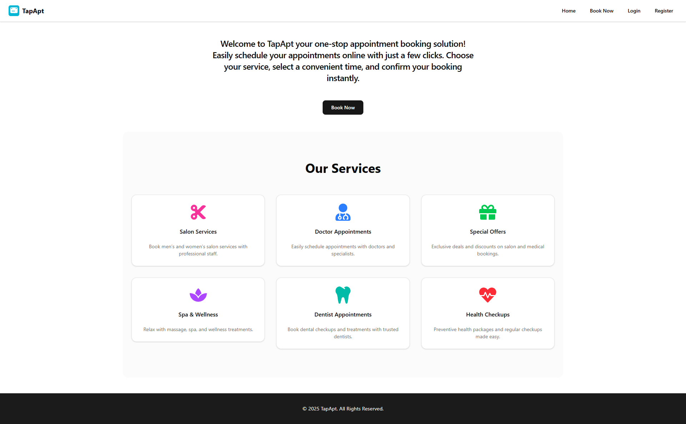
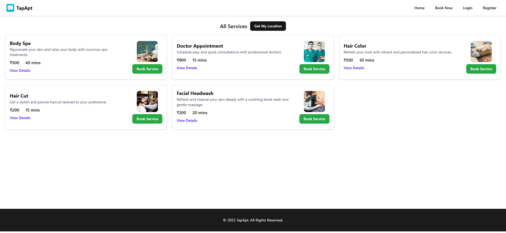
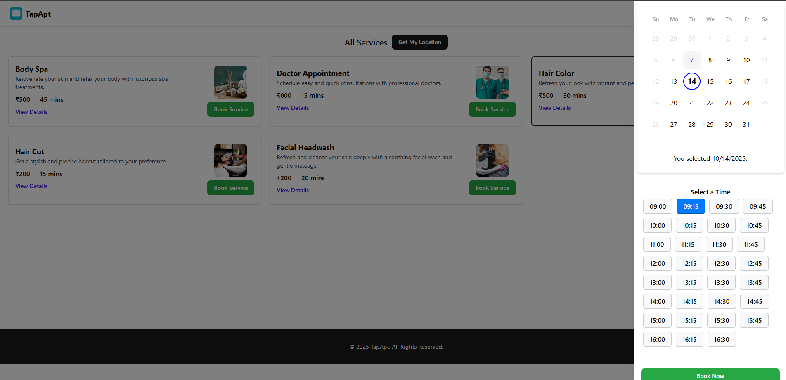
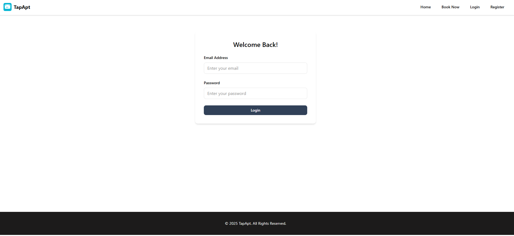
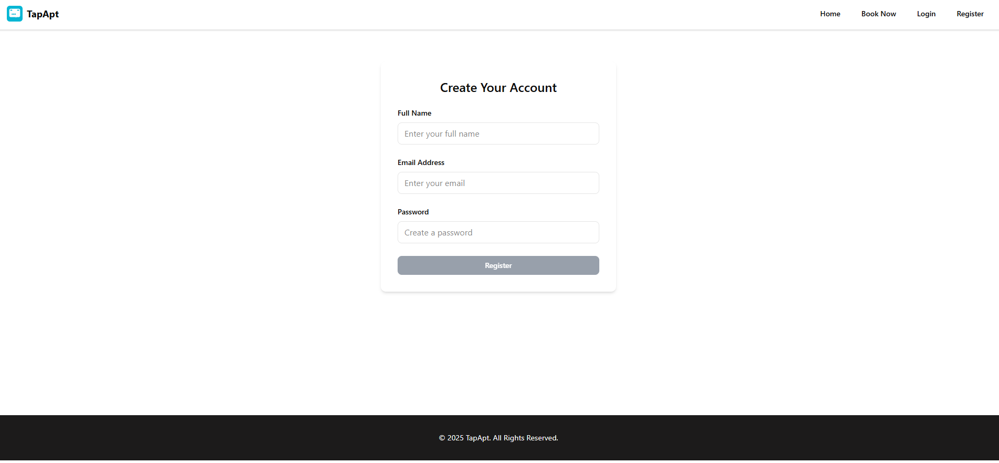
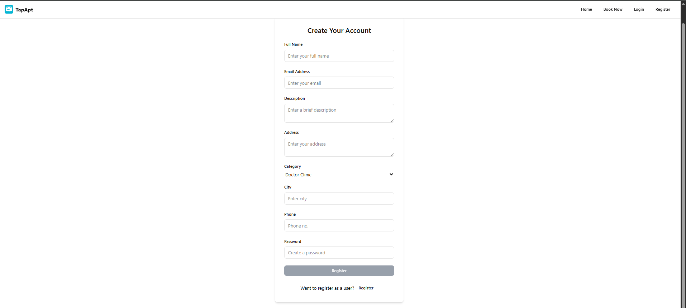

# TapApt

Tap Appointment is a full-stack **appointment booking app** where clients can book services, and admins can manage availability and appointments.

##  Features

### Client (Users)
- Browse available services.
- Select date & time and book an appointment.
- View **upcoming** and **past** appointments.
- User authentication (**Login / Register**).
- Register as a vendor (vendors can provide business details and list services).

### Pages (new)
- Home: Marketing and service carousel (images used for services).
- Booking: Select service, date and time to create an appointment.
- Login: User sign-in page.
- Register (User): Create a client account.
- Register (Vendor): Create a vendor account with additional fields (phone, address, city, category).

### Admin
- View and manage all client appointments.
- Set service availability.
- Block days (e.g., **Sundays**, **Saturdays**, or holidays).
- Manage business working hours.

---

##  Tech Stack
- **Frontend**: [Vite](https://vitejs.dev/) + React  
- **Backend**: [Node.js](https://nodejs.org/) + [Express](https://expressjs.com/)  
- **Database**: [MongoDB](https://www.mongodb.com/) + [Mongoose](https://mongoosejs.com/)  
- **Deployment**: [Vercel](https://vercel.com/)  

---

## 📂 Project Structure
root
├── client # Frontend (Vite + React)
└── server # Backend (Node.js + Express + Mongoose)


### Home Section


### Services Section


### Booking Section


### Login Section


### User Register Section


### Vendor Register Section



## Run locally (Windows PowerShell)
From project root open two terminals: one for server and one for client.

Server (backend):
```powershell
cd server
npm install
npm run dev
```

Client (frontend):
```powershell
cd client
npm install
npm run dev
```

Make sure your `.env` for the server is configured with `MONGO_URI`, `JWT_SECRET`, and any other required variables.


